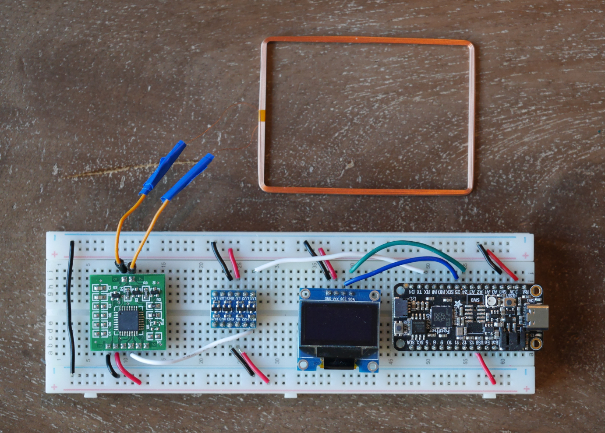
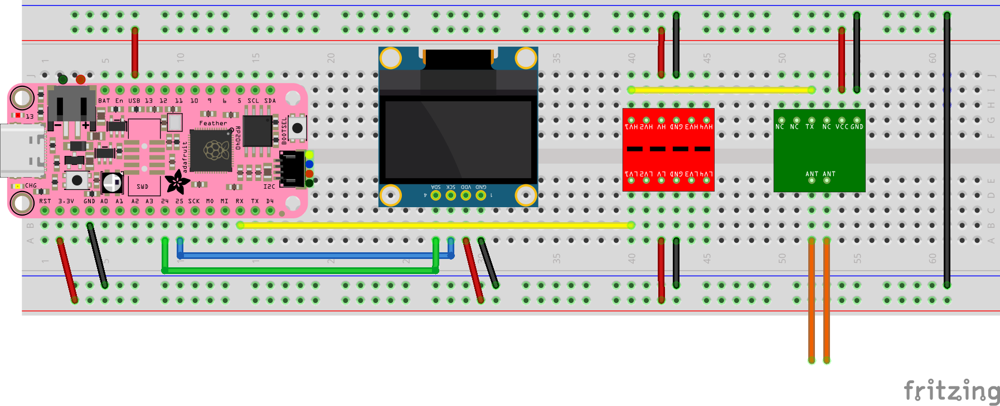

# Pet RFID Reader

This project reads, decodes, and displays the value from pet RFID tags.

It is not recommended to build this project because the RFID drive is an unknown model and has a very short range.

### Parts

* Adafruit Feather RP2040
* OLED display I2C 0.96"
* Level converter - SparkFun Logic Level Converter (BOB-12009)
* RFID Reader - Unknown model (See photo), needs to support 134.2KHz FDX-B and data out over serial

### Wiring

Connect I2C lines and power to the display.
The Tx from the RFID reader is connected to the Rx on the Adafruit Feather through the level converter.
The level converter is used to change the 5v Tx out from the RFID reader to 3.3v for the RP2040.

### Libraries

* U8g2
